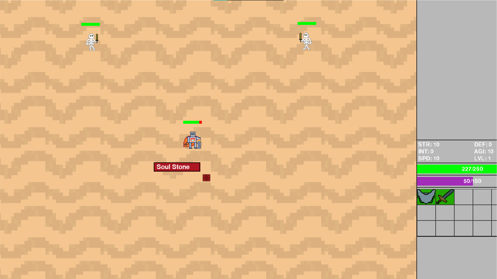

# Arena game

Kill undead on arena, gain experience and find powerfull equipment.

## Build & run

There are two ways to run the game:

1. Run from source code
2. Download built exe file and run it

Link to built app will be soon

### Run from source code

If you have non-Windows OS, then it's your way.

You need [Python 3.9](https://www.python.org/downloads/) to be installed on your computer. Then run commands:

1. Clone this repository

`git clone https://github.com/svkov/arena-pygame.git`

2. Install requirements

`pip install -r requirements.txt`

3. Run the game

`python app.py`

### Download built exe file and run it

Work only on Windows.

Download here (link will appear soon) and run `app.exe` inside.
